# slice2dvf — Diffusion Models for Predicting 3D Motion Fields from 2D Observations

**Master's thesis, Uppsala University — Master's Programme in Image Analysis & Machine Learning**
**Author:** Dafne Spaccavento · **Supervisors:** Onur Ali Zeybekoglu, Dr. David Tilly · **Subject reader:** Orcun Goksel · **Examiner:** Nataša Sladoje

Reconstructing a full 3D deformation vector field (DVF) from only two orthogonal 2D slice observations, using a conditional denoising diffusion model, motivated by real-time motion estimation on MR-Linac radiotherapy systems.

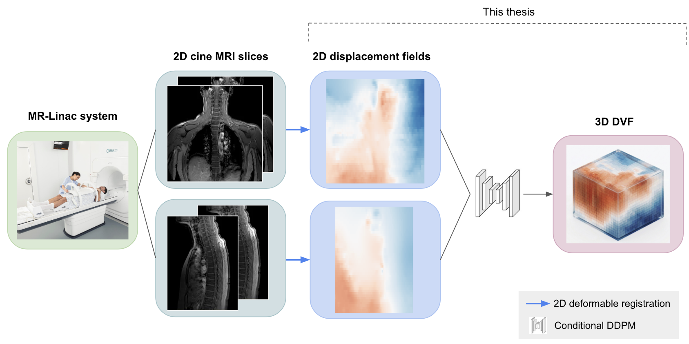
*The clinical pipeline this thesis targets: 2D cine MRI slices are registered into 2D displacement fields, and a conditional DDPM (this work) reconstructs the full 3D DVF from just those two planes.*

## Abstract

Diffusion probabilistic models have recently demonstrated strong performance as learned priors for ill-posed inverse problems, offering stable training, good mode coverage, and the ability to incorporate known constraints at inference time through sampling strategies such as inpainting. This work exploits these properties for a problem arising in MR-guided radiotherapy: reconstructing a full 3D DVF from only two orthogonal 2D mid-plane slice observations, motivated by the constrained 2D cine acquisition geometry of MR-Linac systems.

A conditional diffusion model is trained to reconstruct 3D DVFs from coronal and sagittal mid-plane slices, using a cross-attention conditioning module that lifts the 2D observations into a dense 3D conditioning volume. All experiments are conducted on CT-derived DVFs from the DIR-Lab 4DCT benchmark, since equivalent MR data with paired 3D ground truth is not publicly available. The model is first pre-trained on 500 physics-inspired synthetic DVFs, whose generator parameters were optimised via Bayesian search to match the statistical properties of real respiratory motion fields, and subsequently fine-tuned on eight cases from the DIR-Lab 4DCT benchmark. At inference, the RePaint inpainting strategy enforces the known slice values as hard constraints throughout the reverse diffusion process.

On the synthetic test set, the approach achieves a mean displacement error of 7.57 mm and cosine similarity of 0.737 with RePaint sampling (U=3), recovering spatial structure that a non-learned inverse-distance weighted (IDW) interpolation baseline does not explicitly model, despite the baseline achieving lower scalar error. On the two held-out real test cases, fine-tuning gives qualitative improvements but does not beat the IDW baseline quantitatively — the main bottleneck being the scarcity of real training data (only 8 cases). The result is a complete, reusable experimental framework for diffusion-based 3D DVF reconstruction from sparse 2D observations, with data availability identified as the main direction for future work.

## Why this problem

Respiratory motion moves lung tumours and organs at risk by tens of millimetres per breathing cycle. MR-Linac systems can image in real time, but only in 2D (coronal + sagittal cine) — full 3D acquisition during treatment is impractical. Classical deformable image registration needs a full 3D image pair, which isn't available at treatment time. This thesis asks: **can a generative model fill in the missing 3D structure from just two 2D planes?**

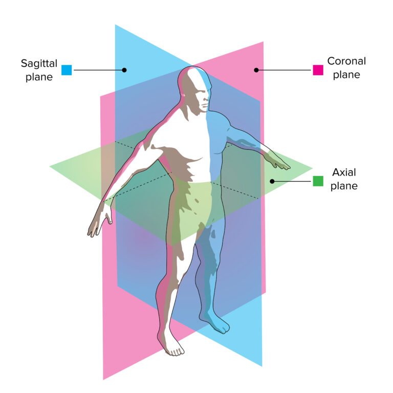
*The coronal and sagittal mid-planes used as conditioning observations throughout this work.*

This is a genuinely ill-posed inverse problem — the two observed planes constrain only a small fraction of the volume, and infinitely many DVFs are consistent with them. A generative prior over physically plausible motion fields is needed to regularise the reconstruction.

## Method overview

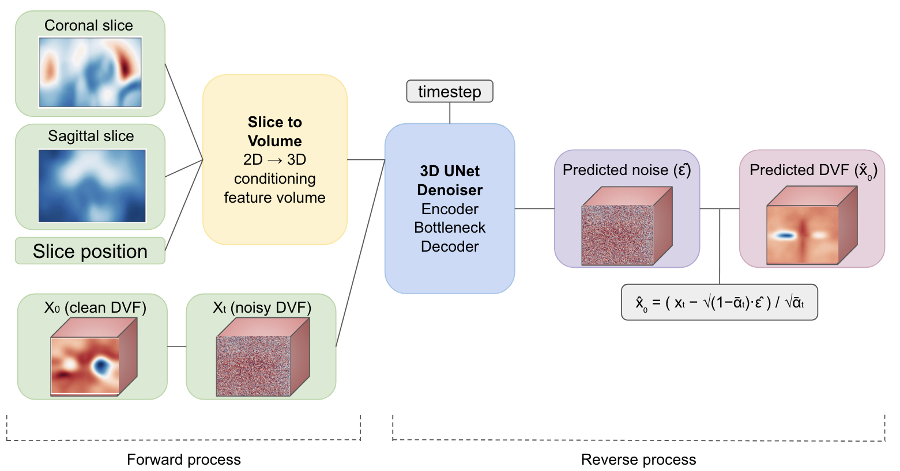
*The SliceToVolume module lifts the two 2D slices into a 3D conditioning volume; a 3D U-Net denoiser then predicts the noise at each reverse diffusion step, conditioned on that volume.*

**1. Synthetic pre-training data.** With only 10 real patient cases available, a physics-inspired synthetic DVF generator was built and its parameters (amplitude ranges, spatial scales, smoothing, clipping) optimised with Optuna (80 trials, TPE sampler) to match the statistical properties of the real DIR-Lab DVFs — displacement percentiles, magnitude distribution, spatial smoothness, and lung-region vs. background ratio. 500 training + 100 test synthetic DVFs were generated at 256×256×128 and downsampled to 128×128×64 for training.

| Real DVF (copd04) | Representative synthetic DVF |
|---|---|
| 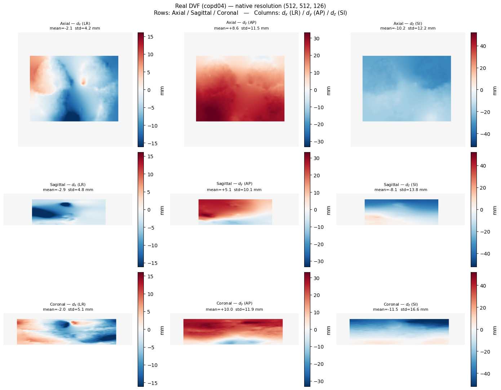 | 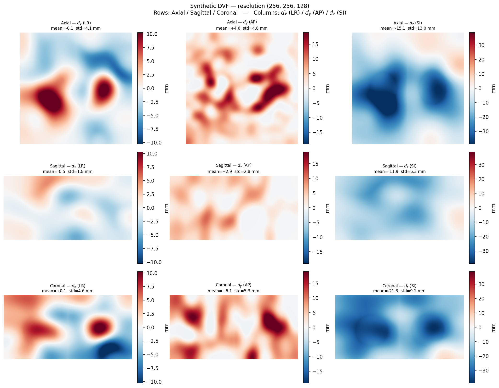 |

**2. Conditioning architecture (`SliceToVolume`).** Five variants were compared, from a simple non-parametric broadcast to a cross-attention module that lets the coronal and sagittal feature branches exchange information before fusion, plus two appended distance-to-plane channels. The cross-attention variant won on every metric and is used throughout the rest of the work.

**3. Denoiser.** A 3D U-Net (two-level encoder–bottleneck–decoder, ~18–21 input channels depending on the conditioning variant) predicts the added noise at each diffusion step, with timestep conditioning injected as a multiplicative scale (early layer) and additive bias (deeper layers).

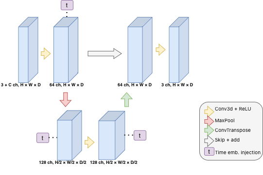

**4. Training.** DDPM noise-prediction loss (MSE) plus an annealed gradient-smoothness regulariser. 1000 epochs on the synthetic set (Adam, cosine LR schedule, A100 GPU).

**5. Sampling strategies.** Three were compared: standard stochastic DDPM (1000 steps), deterministic DDIM (fewer steps, faster), and **RePaint** — an inpainting approach that re-imposes the known coronal/sagittal slice values as hard constraints at every reverse step, with `U` resampling iterations per timestep to harmonise the generated and known regions. RePaint (U=3) was the best sampler overall.

**6. Fine-tuning on real data.** The synthetic-pretrained model is fine-tuned on 8 of the 10 DIR-Lab COPD cases (2 held out for testing), 150 epochs, with checkpoint selection based on a 5-epoch rolling average of the (noisy, small-dataset) training loss.

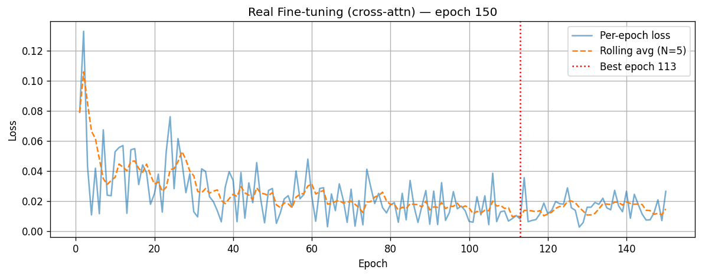

**7. CT-conditioned variant.** Since DIR-Lab provides CT volumes, a second fine-tuning branch additionally conditions on CT slices via a zero-convolution ControlNet-style branch, to test whether anatomical context helps disambiguate the reconstruction.

## Results

### Baseline

All learned models are compared against a non-parametric **inverse-distance weighted (IDW) interpolation** baseline — blending the two known planes by inverse distance, with no learning and no prior over motion patterns.

### Synthetic test set (N=100)

Best conditioning architecture (cross-attention + distance channels) and best sampler (RePaint, U=3):

| Sampler | MAE dx / dy / dz (mm) | MDE full (mm) | CosSim full |
|---|---|---|---|
| IDW (baseline) | 1.87 / 3.03 / 5.42 | 7.24 | 0.790 |
| DDIM (100 steps) | 2.64 / 3.55 / 11.41 | 13.16 | 0.555 |
| DDPM (1000 steps) | 2.37 / 3.58 / 8.68 | 10.65 | 0.641 |
| **RePaint (U=3)** | **2.02 / 3.27 / 5.47** | **7.57** | **0.737** |

The IDW baseline wins on scalar error — expected, since the synthetic DVFs vary smoothly between the two planes — but the diffusion model recovers spatial structure and motion patterns the baseline can't represent (see figure below).

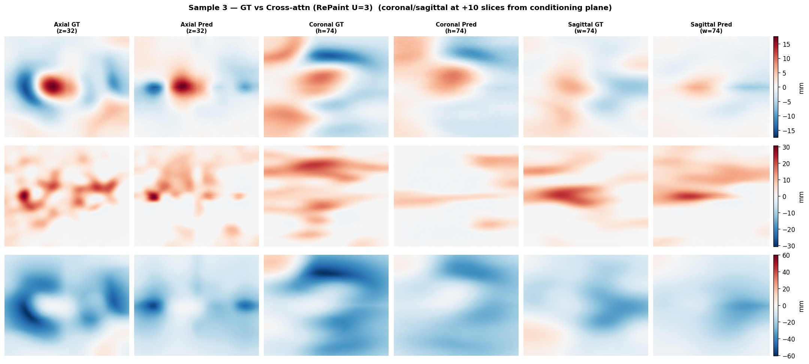
*RePaint (U=3) reconstruction vs. ground truth on a representative synthetic test sample.*

### Real DIR-Lab test cases (copd09, copd10)

| Method | copd09 TRE (mm) | copd10 TRE (mm) |
|---|---|---|
| IDW baseline | 5.96 | 6.47 |
| Pretrained only, RePaint (no fine-tune) | 10.85 | 15.33 |
| Fine-tuned, DDPM | 12.49 | 19.24 |
| Fine-tuned, RePaint | 8.30 | 15.07 |
| Fine-tuned, RePaint + CT conditioning | 8.53 | 15.41 |

TRE = target registration error on the DIR-Lab benchmark's 300 anatomical landmark pairs, in mm (lower is better). Fine-tuning clearly helps over the pretrained-only model, but nothing yet beats the simple interpolation baseline on this metric — the real bottleneck is that 8 training cases is not enough data to adapt a generative model to real respiratory motion. See the thesis (Chapter 4) for a full discussion of why the scalar metrics understate what the model is actually learning.

| IDW baseline | Fine-tuned, DDPM | Fine-tuned, RePaint (best real config) |
|---|---|---|
| 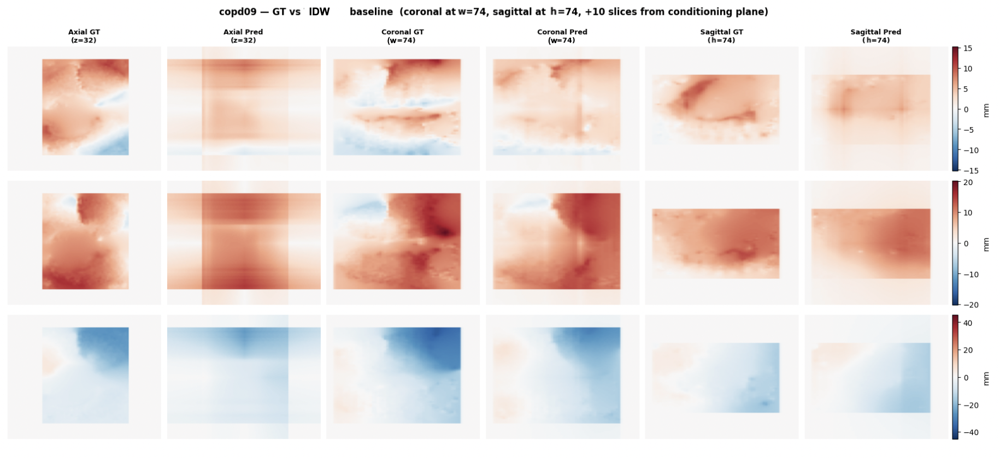 | 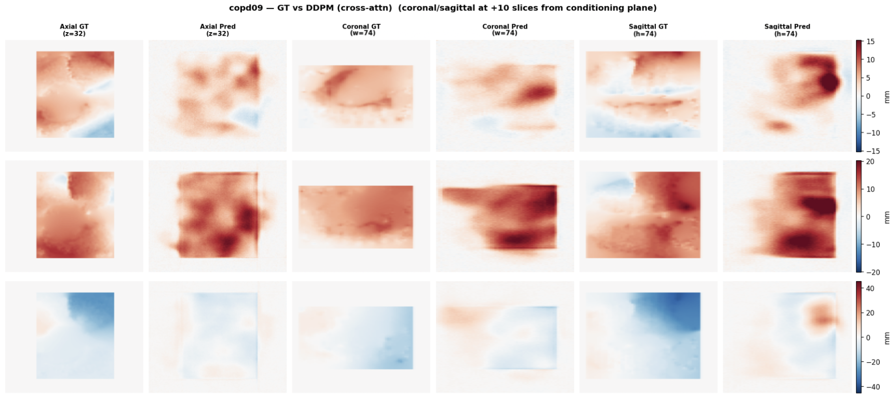 | 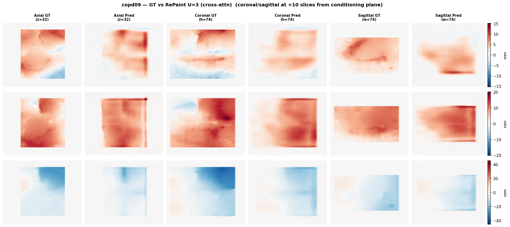 |

## Repository structure

```
slice2dvf/
├── code/              # All scripts — see table below
├── results/           # Saved images (old)
├── visual/            # General figures (old)
├── visual_analysis/   # Additional analysis
├── figures/           # Thesis figures used in this README (add these)
└── README.md
```

## Code

| Script | What it does |
|---|---|
| `generate_dataset_.py` | Physics-inspired synthetic DVF generator (Bayesian-optimised parameters) — produces the 500 train / 100 test synthetic dataset |
| `preprocess_dataset.py` | Downsamples to 128×128×64 and z-score normalises the dataset before training |
| `SYNT_train_direct_broadcast.py` | Trains the DDPM with the **direct broadcast** SliceToVolume variant (no learned parameters) |
| `SYNT_train_sumfusion.py` | Trains with the **learned-encoder + element-wise sum** SliceToVolume variant |
| `SYNT_train_concat.py` | Trains with the **learned-encoder + concatenation fusion** SliceToVolume variant |
| `SYNT_train_cross_a.py` | Trains with the **cross-attention + distance channels** SliceToVolume variant — the best-performing architecture, used everywhere downstream |
| `SYNT_train_4slices_cross_a.py` | Trains the 4-slice conditioning variant (two coronal + two sagittal slices at 25%/75%) for the sensitivity analysis in §3.3.3 |
| `SYNT_ddpm_direct_broadcast.py` | DDPM sampling/evaluation for the direct-broadcast architecture |
| `SYNT_ddpm_sumfusion.py` | DDPM sampling/evaluation for the sum-fusion architecture |
| `eval_concat_ddpm.py` | DDPM sampling/evaluation for the concat-fusion architecture |
| `SYNT_ddpm_cross_a.py` | DDPM sampling/evaluation for the cross-attention architecture |
| `SYNT_ddim_cross_a.py` | DDIM (reduced-step, deterministic) sampling/evaluation for the cross-attention architecture |
| `SYNT_repaint_cross_a.py` | RePaint inpainting-based sampling/evaluation for the cross-attention architecture — the best synthetic configuration |
| `SYNT_repaint_4slices_cross_a.py` | RePaint sampling/evaluation for the 4-slice conditioning variant |
| `SYNT_ddpm_trilinear.py` | *Please confirm* — likely the IDW/trilinear interpolation baseline evaluation used throughout Chapter 3 |
| `REAL_finetune_cross_a.py` | Fine-tunes the synthetic-pretrained cross-attention model on the 8 real DIR-Lab training cases |
| `REAL_finetune_cross_a_ct.py` | Fine-tunes with the additional CT-conditioning (ControlNet-style zero-convolution) branch |
| `REAL_eval_ddpm_cross_a.py` | DDPM evaluation of the fine-tuned model on the real held-out test cases |
| `REAL_repaint_cross_a.py` | RePaint evaluation of the fine-tuned (DVF-only) model on the real held-out test cases |
| `REAL_repaint_real_cross_a_PT.py` | RePaint evaluation of the **pretrained-only** model (no fine-tuning) on real data — the "PT" row in the results table |
| `REAL_repaint_real_cross_a_ct.py` | RePaint evaluation of the CT-conditioned fine-tuned model on real data |

## Data

| Dataset | Description |
|---|---|
| Real DVFs | 10 COPD cases, DIR-Lab 4DCT benchmark, precomputed via MATLAB DIR on T00–T50 inhale/exhale pairs |
| Synthetic (full res) | 500 train / 100 test, 256×256×128, generated at 0.625×0.625×2.5 mm spacing |
| Synthetic (training res) | Downsampled to 128×128×64, z-score normalised |
| Fine-tuning split | copd01–copd08 (train), copd09–copd10 (held-out test) |

**Note:** real DVFs are in millimetres (NIfTI, `.nii.gz`); synthetic DVFs at full resolution are also in mm, but the downsampled/normalised versions used for training are **not** in physical units.

## Dependencies

- Python 3.10+
- `torch`, `numpy`, `nibabel`, `scipy`, `matplotlib`
- `optuna` (Bayesian optimisation of the synthetic generator and hyperparameter search)
- `tqdm`

```bash
pip install torch numpy nibabel scipy matplotlib optuna tqdm
```

## Running it

```bash
# 1. Generate the synthetic dataset
python code/generate_dataset_.py

# 2. Preprocess (downsample + normalise)
python code/preprocess_dataset.py

# 3. Pre-train on synthetic data (best architecture)
python code/SYNT_train_cross_a.py

# 4. Evaluate with the best sampler
python code/SYNT_repaint_cross_a.py

# 5. Fine-tune on real DIR-Lab data
python code/REAL_finetune_cross_a.py

# 6. Evaluate on the real held-out test cases
python code/REAL_repaint_cross_a.py
```

Each stage saves checkpoints/outputs consumed by the next — run in order for a first pass. GPU (tested on an NVIDIA A100 80GB) is strongly recommended: full synthetic pre-training takes 5–12 hours depending on architecture.

## Key findings

- **RePaint inpainting is essential**, not optional: hard-constraining the known planes throughout the reverse process cuts MDE by roughly 50% versus DDIM and gives a clear improvement over standard DDPM.
- **Cross-attention conditioning beats simpler fusion strategies** (direct broadcast, sum, concatenation) on every metric, by letting the coronal and sagittal branches exchange information before being fused into the 3D volume.
- **Scalar metrics understate the model's qualitative behaviour.** The IDW baseline wins on MDE/TRE almost everywhere, but the diffusion model recovers spatial structure and motion patterns the interpolation cannot represent — a gap the thesis argues would be better captured by a structural metric (e.g. SSIM on displacement magnitude) than by pointwise error alone.
- **Data scarcity, not architecture, is the bottleneck on real data.** Eight training cases are not enough to adapt a generative model to the full variability of real respiratory motion; this is the primary direction identified for future work.
- **CT conditioning did not yet help**, likely for the same reason — too little fine-tuning data for the added branch to learn a robust anatomical representation.

## Acknowledgement of AI usage

Generative AI tools were used during preparation of the thesis to assist with debugging/refining Python code, improving clarity of the written text, and checking LaTeX formatting. All technical content, experimental design, implementation decisions, and conclusions are the author's own work.

## Citation

If you use this work, please cite:

```
Spaccavento, D. (2026). Diffusion models for predicting 3D motion fields from 2D observations.
Master's thesis, Uppsala University, IT mBM 26 015.
```